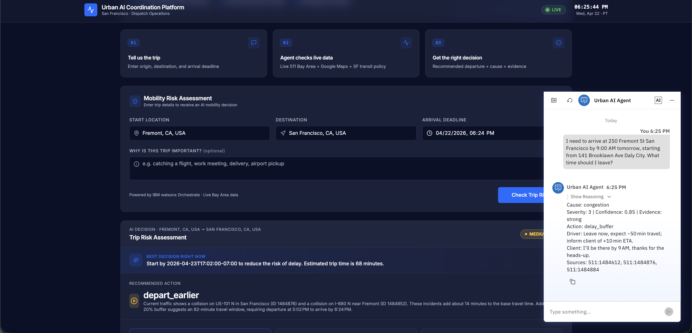

# Urban AI Coordination Platform

Multi-agent AI platform that turns fragmented live traffic signals into one coordinated decision for SF professional drivers and dispatchers.

🔗 **Live demo:** [sfurbanai.online](https://sfurbanai.online)  
🎥 **Video (3 min):** [YouTube](https://www.youtube.com/watch?v=B06OKqli_w4)  
🏆 **Built for:** IBM SkillsBuild Agentic AI Experiential Learning Lab 2026  
👥 **Team:** Qudyan · **Track:** Government & Public Services

---

## The Problem

Professional drivers in San Francisco juggle 3+ disconnected tools: Google Maps for traffic, 511 for incidents, SMS for dispatch, and 911 for emergencies. No tool gives them one coordinated decision. Maps are reactive — they turn red only after a driver is already late.

## The Solution

A multi-agent AI system on IBM watsonx Orchestrate. A supervisor agent cross-references live 511 SF Bay data with Google Maps real-time traffic, applies the SF Transit Safety Policy, and returns one auditable decision with recommended departure time, risk level, main cause, confidence score, and traceable 511 evidence IDs. For emergencies, a specialist agent produces a structured dispatch brief for human operators.

## Architecture

**Supervisor + Specialist multi-agent pattern:**
- **TransitSafetyAgent** (supervisor) — routes all queries, calls live tools, returns decisions
- **OperatorHandoffAgent** (specialist) — triggered on severity 5, confidence < 0.7, or mandatory escalation

**Live integrations:**
- 511 SF Bay Open Data (CHP + Caltrans)
- Google Maps Geocoding, Directions, Places Autocomplete
- IBM Cloud IAM authentication
- SF Transit Safety Policy knowledge grounding

## Tech Stack

- IBM watsonx Orchestrate (multi-agent platform)
- IBM Cloud IAM
- 511 SF Bay Open Data API
- Google Maps Platform
- Custom domain with HTTPS

## Responsible AI

- Every decision cites source 511 incident IDs
- Confidence < 0.7 or severity 5 triggers mandatory human escalation
- Agent does NOT autonomously contact 911 (human-in-the-loop by design, compliance with California Penal Code 148.3)
- Full audit trail on every tool call via Orchestrate reasoning traces
- No API keys or credentials stored in this repository

## Security

This repository contains documentation and architecture only. All API keys, tokens, and credentials are stored in secure backend environment variables on the hosting platform, never in source code.

## License

MIT

## Screenshots

### Dashboard

