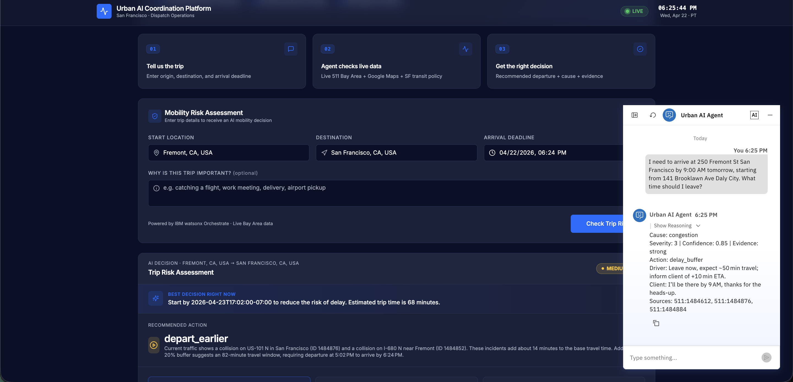

# Urban AI Coordination Platform

**Multi-agent decision support for deadline-aware urban mobility and dispatch coordination.**

🔗 **Live demo:** [sfurbanai.online](https://sfurbanai.online)  
🎥 **3-minute demo:** [YouTube](https://www.youtube.com/watch?v=B06OKqli_w4)  
🏆 **Program:** IBM SkillsBuild Agentic AI Experiential Learning Lab 2026  
👥 **Team:** Qudyan  
🎯 **Track:** Government & Public Services

---

## Executive Summary

Professional drivers and dispatchers in San Francisco often work across disconnected systems for traffic, incidents, routing, dispatch communication, and emergency escalation.

This project explores a different approach: a **multi-agent AI coordination layer** that combines live transportation signals and policy rules into one structured, auditable recommendation.

The goal is not to replace dispatchers or emergency services. It is to help human operators make faster, more consistent decisions from fragmented information.

## Problem

A professional driver may need to check several sources at once:

- Google Maps for routing and traffic
- 511 SF Bay for roadway incidents
- dispatch messages for job requirements
- emergency procedures for high-severity situations

These systems provide information, but they do not necessarily produce one coordinated decision that accounts for deadline risk, incident severity, confidence, and escalation rules.

## Solution

The platform uses **IBM watsonx Orchestrate** with a supervisor/specialist multi-agent pattern.

The supervisor agent cross-references live transportation data and policy guidance, then returns a decision containing:

- recommended departure timing
- risk level
- primary cause
- confidence score
- supporting 511 incident IDs
- escalation status when human review is required

For high-risk situations, a specialist agent prepares a structured handoff for a human operator.

## Multi-Agent Architecture

### TransitSafetyAgent — Supervisor

Responsible for:

- receiving the user or dispatcher request
- calling live data tools
- evaluating traffic and incident context
- applying safety-policy rules
- producing the final recommendation
- routing high-risk cases to the specialist agent

### OperatorHandoffAgent — Specialist

Triggered when:

- incident severity reaches **5**
- confidence falls below **0.70**
- policy requires mandatory escalation

Its role is to organize the situation for human review rather than autonomously take emergency action.

## Data & Integrations

- **511 SF Bay Open Data** — CHP and Caltrans incident information
- **Google Maps Platform** — geocoding, directions, and place autocomplete
- **IBM Cloud IAM** — authentication
- **SF Transit Safety Policy** — knowledge grounding and escalation rules

## Responsible AI Design

- Recommendations cite supporting 511 incident IDs.
- Low-confidence and severe cases trigger escalation.
- The system does **not** autonomously contact 911.
- Human operators remain responsible for emergency escalation.
- Orchestrate reasoning traces provide an audit trail for tool activity.
- Credentials are not stored in this public repository.

## What This Project Demonstrates

- Agentic AI orchestration
- Supervisor/specialist agent design
- Live external-data integration
- Confidence-based escalation
- Human-in-the-loop decision support
- Responsible AI controls
- Explainable operational recommendations

## Technology

**IBM watsonx Orchestrate · IBM Cloud IAM · 511 SF Bay Open Data API · Google Maps Platform**

## Repository Scope

This is a **portfolio and architecture repository** for the IBM SkillsBuild project. The live agent implementation runs through IBM watsonx Orchestrate and connected services; credentials and private configuration are intentionally excluded from source control.

## Screenshot

### Decision-Support Dashboard

## Security

API keys, access tokens, and credentials are stored in secure environment configuration and are not committed to this repository.

## License

MIT
